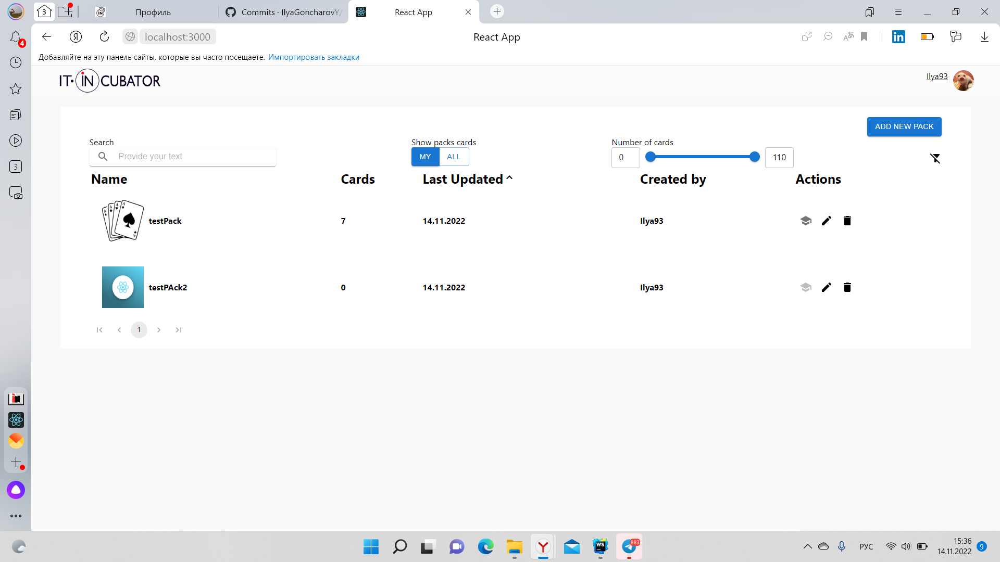
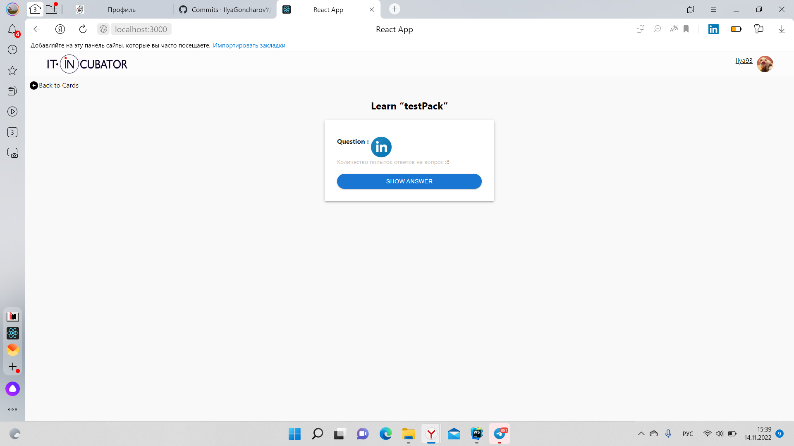
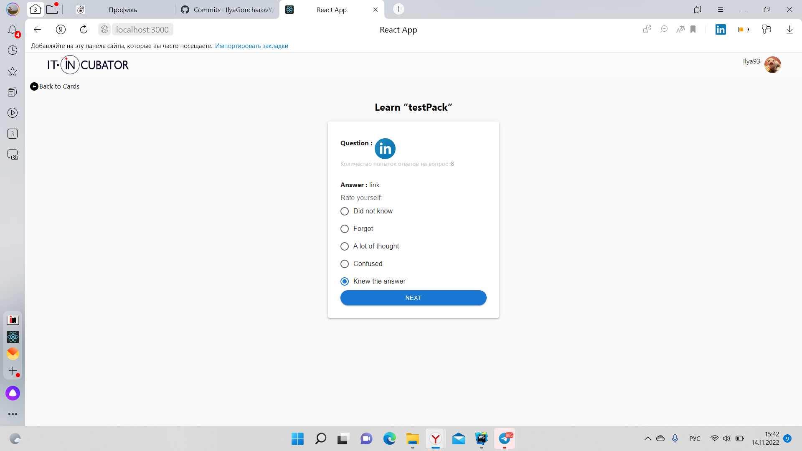
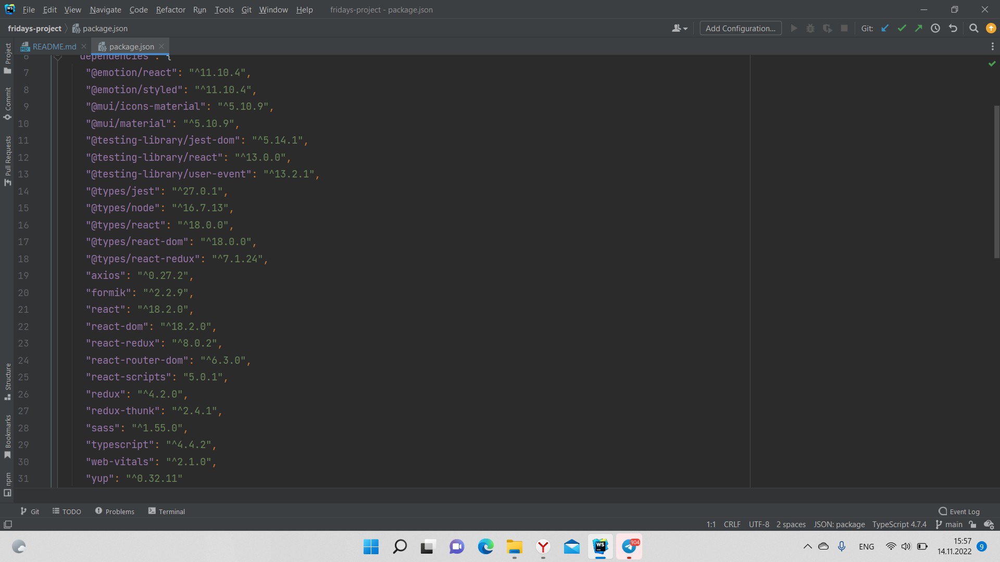

# Название проекта:

Карты для обучения

## Описание проекта:

Работа с картами и колодами. Колоды - хранилище для карт.
Карты - содержат в себе вопросы, на которые необходимо дать один из вариантов ответа.
На сколько, Вы, верно поняли вопрос, и дали на него ответ.
В зависимости от того, на сколько точно вы ответили на вопрос, ему присваивается грейд (от 0 до 5).
Пользователю представляется возможность создавать свои колоды, со своим набором карт. 
Обучаться по картам других пользователей. 

## Пример колод:

## Пример карт:

## Пример обучения по картам с вопросами:

## Пример вариантов ответа:

## Нюансы:
При добавлении изображения используется формат base-64, для пользователя это значит, 
что загружать картинки придётся весом не более 1 мб.

## Технологии:

## Архитектура проекта:
<ul>
<li>Папка api - запросы на сервер (axios)</li>
<li>Папка bll - редьюсеры по таскам и общий store</li>
<li>Папка common - пере используемые компоненты, картинки, общие файлы</li>
<li>Папка component - основные компоненты, для работы всего приложения</li>
<li>Папка utils - общие утилитные функции, для основных компонент.</li>
<li>Компонента App.tsx находится в корневой папке проекта.</li>
</ul>

## Файл package.json:

